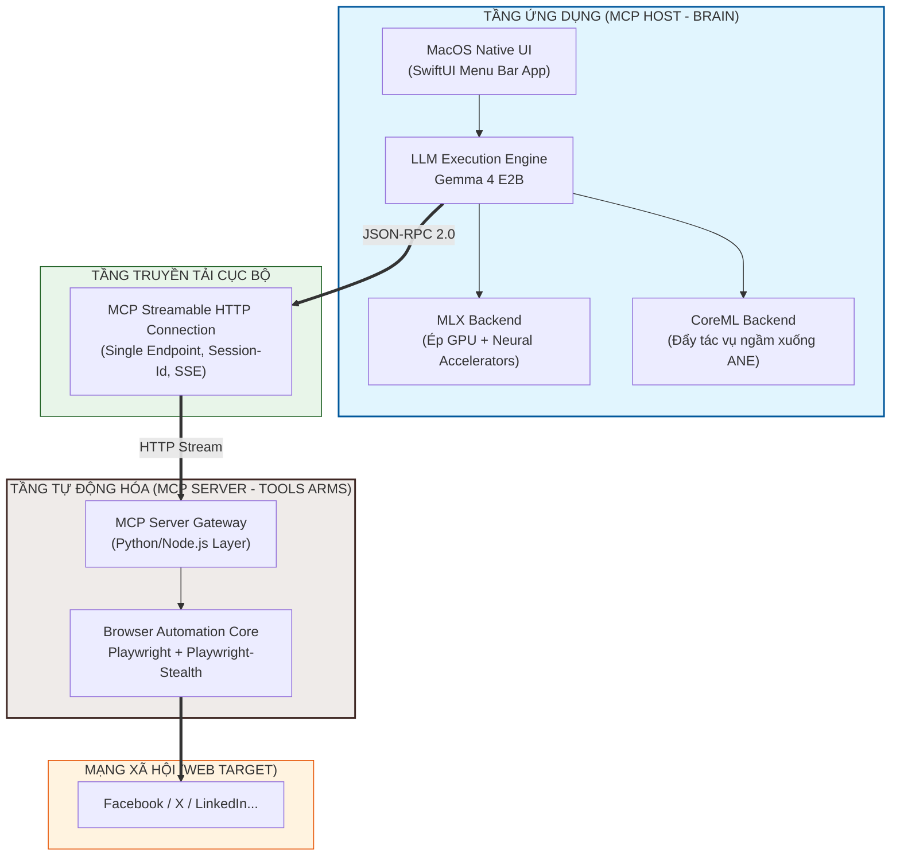

# APPFLOW.md - Luồng Hoạt động Ứng dụng Chi tiết

Tài liệu này mô tả chi tiết quy trình xử lý dữ liệu theo thời gian thực (Step-by-Step Data Flow) bên trong hệ thống AI Agent "Chim Lợn" từ lúc bắt đầu quét tin đến khi thực thi tương tác hoàn tất.

## 1. Sơ đồ Tuần tự Chi tiết (Sequence Diagram)

Luồng giao tiếp được thiết lập qua giao thức **Streamable HTTP MCP** kết nối qua mạng cục bộ:



## 2. Giải thích Chi tiết Từng Bước Chạy

### Bước 1 & 2: Giai đoạn Nhận thức (Perception & Ingestion)
- Trình duyệt Playwright lướt qua một bài viết trên X (Twitter). Hệ thống Anti-detect Stealth sẽ ẩn mọi cờ tự động hóa (Automation flags).
- Server đóng gói bài viết thành một JSON payload chứa: `text_content`, `author_handle`, `post_timestamp`, và một `screenshot_base64` (nếu cần).
- Dữ liệu được đẩy đi qua cổng HTTP mã hóa. Vì Host mở kết nối bằng header `text/event-stream`, dữ liệu được truyền tải theo dạng các chunk nhỏ liên tục, giúp tiết kiệm bộ đệm RAM của chip M4/M5.

### Bước 3: Giai đoạn Suy luận và Tư duy cục bộ (Reasoning Block)
- Bộ não AI tải dữ liệu vào vùng đệm RAM Thống nhất của chip M4/M5. 
- Mô hình chạy chuỗi mã lệnh tư duy đặc thù. Token `<|think|>` bắt đầu mở ra, LLM tự vấn cô lập:
  * *"Bài viết của @tech_insider nói về hiệu năng chip M4/M5. Ngữ cảnh tích cực. Mình cần đưa ra bình luận mang tính bổ sung kiến thức chuyên sâu để kéo follower."*
- Sau khi đóng block `</|think|>`, mô hình chuyển sang trạng thái sinh cấu trúc đầu ra (Structured Output). Nó ép định dạng đầu ra thành một JSON Schema sạch sẽ, không chứa các ký tự thừa text thuần túy.

### Bước 4 & 5: Giai đoạn Điều khiển và Thực thi (Command & Control)
- App Host gửi một HTTP POST request chứa chuỗi lệnh JSON đã bóc tách tới địa chỉ MCP Server kèm theo `Mcp-Session-Id` để đảm bảo thực thi đúng trên tab trình duyệt hiện hành.
- MCP Server phân rã JSON, gọi hàm tương ứng trong API của Playwright:
```python
  await page.locator(target_selector).click()
  ```

### Bước 6: Tối ưu hóa Hành vi Người thật (Humanization Engineering)
Đây là bước tối quan trọng để tài khoản không bị hệ thống quét của mạng xã hội gắn cờ vi phạm (Ban/Shadowban):
- **Tốc độ gõ phím biến thiên (Human Typing Simulation):** Khi điền văn bản vào ô bình luận, thay vì dán (paste) toàn bộ đoạn văn trong 1 mili-giây, Playwright sẽ duyệt qua từng ký tự trong chuỗi text. Khoảng thời gian giữa mỗi lần gõ phím (`page.type(..., delay=X)`) được thiết lập ngẫu nhiên bằng hàm phân phối chuẩn từ 50ms đến 180ms.
- **Độ trễ hành vi ngẫu nhiên (Random Behavioral Jitter):** Sau khi gõ xong bình luận, hệ thống tự tạo một khoảng ngừng nghỉ từ 1.5 đến 4 giây giả lập hành động người dùng đang đọc lại đoạn văn kiểm tra chính tả trước khi rê chuột bấm nút "Đăng".

### Bước 7 & 8: Hoàn tất chu kỳ và Viễn trắc (Telemetry & Telemetry Updates)
- Sau khi bấm nút Đăng thành công, Playwright đợi phần tử UI hiển thị trạng thái "Đã gửi".
- Server stream một Event thành công chứa dữ liệu: `{"status": "success", "platform": "X", "action": "comment", "tokens_used": 142}` về lại Host.
- Giao diện SwiftUI của App Host nhận tín hiệu, ngay lập tức cập nhật biểu đồ thống kê KPI tương tác trong ngày, giải phóng bộ nhớ cache cũ, đưa GPU M4/M5 về trạng thái tiết kiệm điện năng để chuẩn bị cho vòng lặp lướt feed tiếp theo.