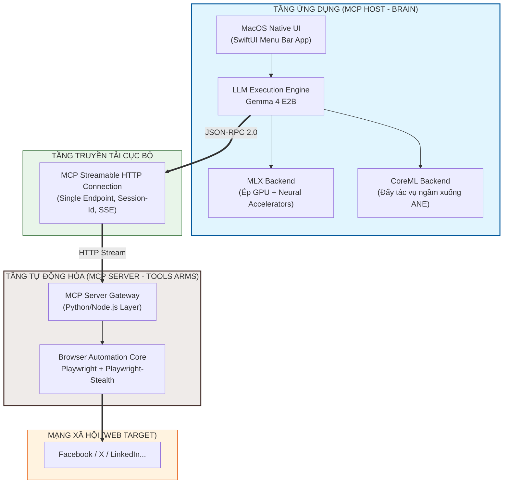

# ARCHITECTURE.md - Kiến trúc Kỹ thuật Hệ thống

Tài liệu này đặc tả chi tiết kiến trúc phần mềm, cấu trúc liên kết và giải pháp công nghệ được áp dụng cho hệ thống AI Agent **"Chim Lợn"** chạy trên chip Apple M5.

## 1. Sơ đồ Kiến trúc Tổng quan (Decoupled Architecture)

Hệ thống được thiết kế theo mô hình client-server phi tập trung. Trực quan hóa cấu trúc phân tầng như sau:

## 2. Chi tiết Giao thức Truyền tải: Streamable HTTP MCP

Hệ thống loại bỏ cơ chế kết hợp phức tạp cũ (HTTP POST + SSE Endpoint riêng biệt) để chuyển sang chuẩn mã nguồn mở **Streamable HTTP**.

### Cơ chế Kết nối Đơn Endpoint (Single-Route POST)
Mọi yêu cầu giao tiếp giữa Host và Server đều đi qua một endpoint duy nhất, ví dụ: `http://localhost:8080/mcp`. Chế độ truyền tải dữ liệu được định đoạt hoàn toàn bằng HTTP Headers:

1. **Chế độ Đồng bộ (Non-streaming Request):**
   - **Header:** `Accept: application/json`
   - **Áp dụng:** Cho các lệnh thực thi ngắn, trả kết quả ngay lập tức (Ví dụ: Lấy tiêu đề trang, kiểm tra trạng thái đăng nhập).
   - **Cơ chế:** Server xử lý xong JSON-RPC phản hồi ngay lập tức và ngắt kết nối.

2. **Chế độ Bất đồng bộ (Streaming Response):**
   - **Header:** `Accept: text/event-stream`
   - **Áp dụng:** Cho các tác vụ dài hạn (Ví dụ: Chờ trình duyệt tải trang, lướt feed liên tục, giải mã captcha, luồng log sự kiện gõ phím).
   - **Cơ chế:** Kết nối giữ ở trạng thái Mở (Long-lived connection). Server liên tục stream các sự kiện dạng Server-Sent Events (SSE) về cho Host. 
   - **Quản lý Phiên:** Server cấp một `Mcp-Session-Id` duy nhất trong header phản hồi đầu tiên. Host sử dụng ID này cho tất cả các request POST tiếp theo để đảm bảo tương tác trên cùng một phiên trình duyệt.

## 3. Chiến lược Tối ưu hóa trên Phần cứng Apple M5

Kiến trúc chip M5 tích hợp cấu trúc bộ nhớ thống nhất siêu băng thông kết hợp lõi Neural Accelerator trong GPU và Apple Neural Engine (ANE) nâng cấp. Hệ thống khai thác triệt để phần cứng này qua cơ chế chuyển đổi linh hoạt:

- **MLX Engine (GPU-Centric Mode):** Kích hoạt khi Agent cần suy luận phức tạp bằng hình ảnh (Multimodal Vision) hoặc sinh chuỗi bình luận dài với tốc độ cực cao. MLX tương tác trực tiếp với Metal API, huy động cụm xử lý ma trận của GPU M5 để đạt hiệu năng tối đa.
- **CoreML Engine (ANE Hybrid Mode):** Kích hoạt khi Agent chạy ở chế độ nền giám sát thông báo (Background Monitoring Mode). Mô hình được biên dịch qua CoreML để phân phối tác vụ xuống ANE và CPU. GPU được đưa vào trạng thái ngủ giúp máy không bị nóng, duy trì thời lượng pin cả ngày cho MacBook M5.

## 4. Bảo mật và Cô lập Tiến trình (Security & Process Isolation)

- **An toàn Tiến trình (Process Sandboxing):** Khi Playwright gặp mã độc hoặc trang web quảng cáo nặng gây tràn bộ nhớ (Memory Leak), tiến trình MCP Server có thể bị crash cục bộ nhưng không làm ảnh hưởng tới App chính Swift chứa bộ não AI. Host sẽ tự động gửi lệnh hồi sinh (Respawn) MCP Server.
- **Bảo mật Cổng nội bộ:** Do sử dụng giao thức HTTP tiêu chuẩn, mọi Request gửi từ Host đến Server đều được đính kèm mã xác thực Token (`Authorization: Bearer <local_token>`) nhằm ngăn chặn tuyệt đối các ứng dụng rác khác trong hệ thống hack vào trình duyệt tự động để đánh cắp session mạng xã hội.